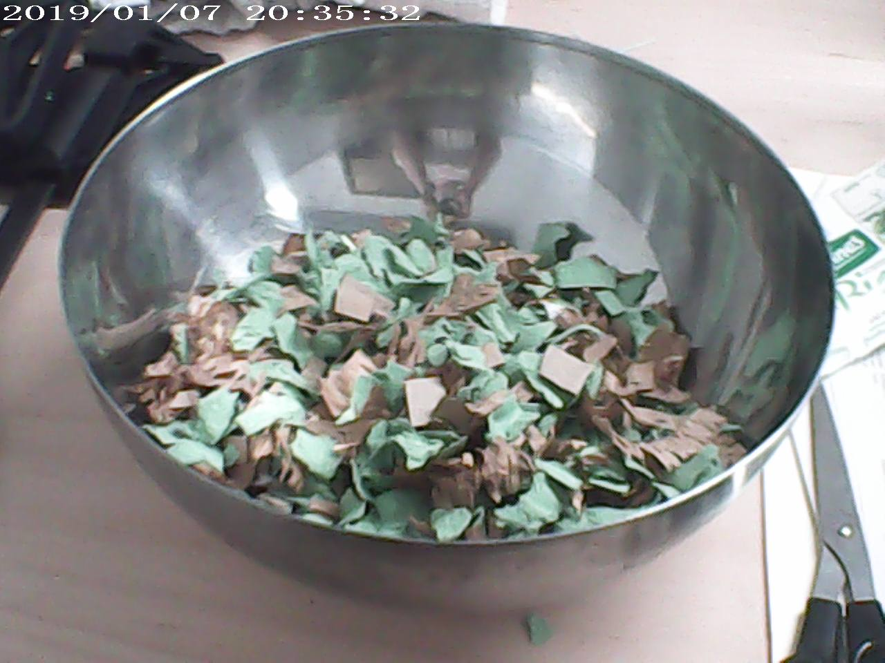
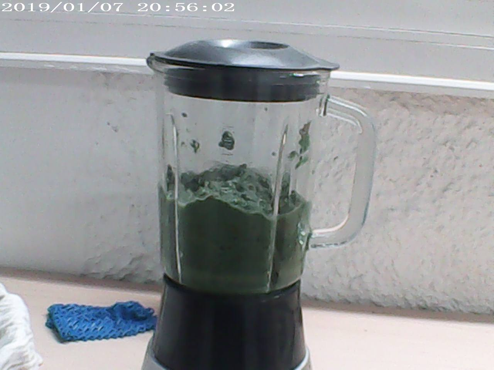
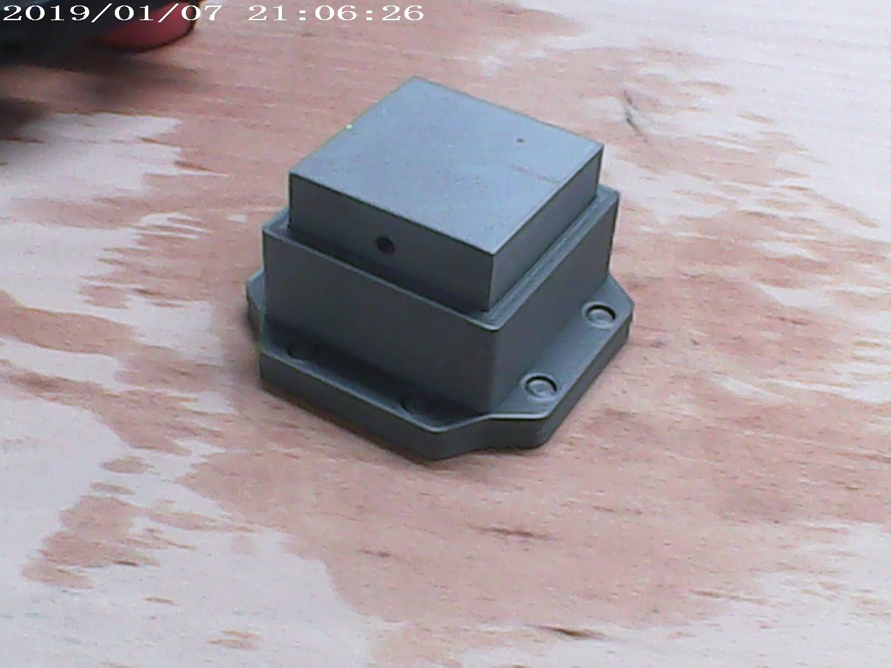

# Rapport-de-stage
Chez [Love Open Design](https://love-open-design.com/) du 14/06/2021 au 25/06/2021.

### Liens utiles
##### Ressources pour projets du stage
- [Tuto vidéo moulage carton de XYZ Aidan](https://www.youtube.com/watch?v=0ItPfhx3ulw)
- [Moules du cube terrain](https://www.thingiverse.com/thing:3912997)
- [Instructions pour réaliser le cube terrain](https://www.instructables.com/Recycle-Cardboard-Into-Anything-With-3D-Printing/)

##### Entre technologie et société
- [Entre sciences, technologie et arts... Waag](https://waag.org/)
- [E-nable](https://e-nable.fr/)
- [HumanLab](https://myhumankit.org/) 
- [Nervous System](https://n-e-r-v-o-u-s.com/index.php)

##### Découvrir de nouvelles manières de travailler
- [Synthaxe Markdown](https://www.markdownguide.org/cheat-sheet)
- [Formation multidisciplinaire sur les nouvelles formes de fabrication et de design distribué appliqué à l'industrie textile](https://textile-academy.org/)
- [Fabricademy: cours en ligne](https://vimeo.com/showcase/7626171)
- [Tutoriels Rhino et GrassHopper](https://class.textile-academy.org/tutorials/)

##### Matériaux
- [Recette bio-matériaux](https://drive.google.com/file/d/1Lm147nvWkxxmPf5Oh2wU5a8eonpqHCVc/view)
- [PreciousPlastic: créations à partir de déchets plastiques](https://preciousplastic.com/index.html)
- [FabTextiles](http://fabtextiles.org/)

#### Livres conseillés
- [Math Art: Tryth, Beauty, and Equation par Stephen Ornes, édition Sterling (2019)](https://www.goodreads.com/book/show/41739506-math-art)
- [Force: dynamic life drawing for animators par Michael D.Mattesi, édition Focal Press (2006)](https://www.amazon.fr/Force-Dynamic-Life-Drawing-Animators/dp/0240808452)
- [Fab Lab: la révolution en marche par Massimo Menichinelli, édition Pyramyd (2015)](https://www.amazon.fr/Fab-Lab-r%C3%A9volution-est-marche/dp/2350173410)
- [Color and Light: a guide for the realist painter par James Gurney, édition Andrews McMeel (2010)](https://www.amazon.fr/Color-Light-Guide-Realist-Painter/dp/0740797719)

---

## Moulage en carton
*Expérimentations sur le carton moulé d'après la vidéo de [XYZ Aidan](https://www.youtube.com/watch?v=0ItPfhx3ulw). Ce processus permettrait de donner une seconde vie aux cartons et papiers, les transformant alors en objets solides et potentiellement compostables.*

### 1. Phase de test avec cube terrain

#### Impression 3D

*Schéma des différents éléments du moule pour réaliser le cube terrain*

|  | Base | Mur | Presse |
| --- | --- | --- | --- |
| **Remplissage** | 10-15% | 15-20% | 10-15% |
| **Périmètres** | 2 | 3 | 2 |
| **Premières couches** | 2-3 | 2 | 2-3|
| **Dernières couches** | 3-4 | 2 | 3-4|

*Paramètres impression 3D sur logiciel [PrusaSlicer](https://www.prusa3d.com/prusaslicer/)*

*Résultat de l'impression 3D*

#### Préparation de la pâte et moulage 

Découpage de **boîtes d'oeufs** et de **cartons** que l'on mixe avec de l'**eau** et une **cuillère de riz bouilli**. On cherche à créer une **pâte** afin de la presser dans le moule "cube terrain" qui a été imprimé.

Il est important de bien se débarasser de l'eau en essorant la pâte après l'avoir mixée. En effet, l'eau est nécessaire dans cette mixture car elle permet de rompre les fibres de cellulose qui donnent leurs formes aux cartons. Ainsi, si on ne se débarasse pas de l'eau, le carton ne reprendre jamais une forme vraiment solide.

Enfin, on assemble la base et les murs dans lesquels on verse la pâte à carton. On ajoute ensuite la presse afin de comprimer la pulpe pour lui donner une nouvelle forme et faire s'échapper l'excédent d'eau.

***Problème*** : Le séchage n'est pas très rapide. 
***Solution*** : Retournement du moule afin de laisser mieux l'eau couler hors du moule et séchage au soleil.

#### Démoulage et résultat final

### 2. Phase d'expérimentation

#### Modélisation et impression 3D du moule

Suite à cette première phase de test, on créé un autre contenant. Il est important de bien penser son extraction ainsi que sa création sur l'imprimante 3D.

On modélise un contenant pour créer un moule en plusieurs parties afin de faciliter la future extraction de l'objet.

/VERSION 1 MOULE/

***Problème***: Comment séparer les morceaux du moule sans le casser?
***Solution***: Ajouter des bords afin de permettre une bonne prise.

/VERSION 2 MOULE AVEC BORDS/

On imprime ensuite un modèle réduit du moule final. Cela permet de vérifier s'il n'y a pas de problèmes avant d'imprimer en taille réelle

/VERSION MINI AVEC ECARD/

***Problèmes***: Comme les picôts sont très droits, il est difficile d'assembler la base et les murs. De plus, il y a un trop gros écard entre le diamètre intérieur de la presse et celui des murs: ainsi, le couvercle n'est pas vraiment attaché et bouge beaucoup.
***Solutions***: On arrondie les picôts et on en ajoute pour mieux fixer la presse avec les murs.

/VERSION FINALE/

On imprime finalement les trois parties du moule

***Problème***: En essayant d'assembler la presse et les murs, on observe un jeu trop important entre les picôts et leur place emboîtée dans les mur.
***Solutions***: Création de petites bagues afin de combler cet écard.

/DIFFERENTES BAGUES/
*On teste trois différents types de bagues avec des dimensions différentes pour trouver la meilleure. On imprime ensuite celle qui fonctionne le mieux*

/BAGUE DANS TROUS/
*Après avoir limé certaines des bagues, on les enfonce dans les renfoncements de la base.*

/BAGUE SUR PICOT/
*Cependant, lorsqu'on essaye d'assembler le socle au mur, les bagues sortent des trous et se coincent autour des picots. Ainsi, pour ne pas lutter inutilement, on déplace chacune des bagues autour de son picôt.*

/ACCIDENT/
*L'assemblage est désormais facile entre la base et les murs mais lorsqu'on les sépare l'un de l'autre, il y a une certaine résistance. En essayant de les séparer, un plôt s'est même brisé dans son trou. Ainsi, pour éviter ce genre d'accident, on ponce à nouveau l'extérieur des picôts.*

#### Préparation de la pâte et moulage

#### Démoulage et version finale

## Reproduction du logo des FabLab: design paramétrique

