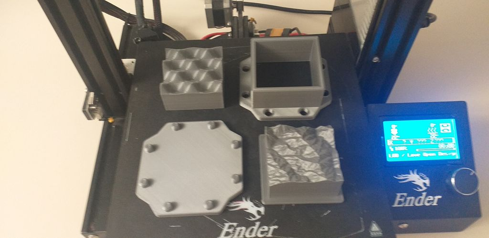

# Rapport-de-stage
Chez [Love Open Design](https://love-open-design.com/) du 14/06/2021 au 25/06/2021.

## Liens utiles
- [Synthaxe markdown](https://www.markdownguide.org/cheat-sheet)
- [Tuto vidéo moulage carton de XYZ Aidan](https://www.youtube.com/watch?v=0ItPfhx3ulw)
- [Moules du cube terrain](https://www.thingiverse.com/thing:3912997)
- [Instructions pour réaliser le cube terrain](https://www.instructables.com/Recycle-Cardboard-Into-Anything-With-3D-Printing/)

## Moulage en carton
### 1. Phase de test avec cube terrain

#### Impression 3D

|  | Base | Mur | Presse |
| --- | --- | --- | --- |
| **Remplissage** | 10-15% | 15-20% | 10-15% |
| **Shells** | 2 | 3 | 2 |
| **Premières couches** | 2-3 | 2 | 2-3|
| **Ceiling Layers** | 3-4 | 2 | 3-4|

*Paramètres impression 3D sur logiciel [PrusaSlicer](https://www.prusa3d.com/prusaslicer/)*

