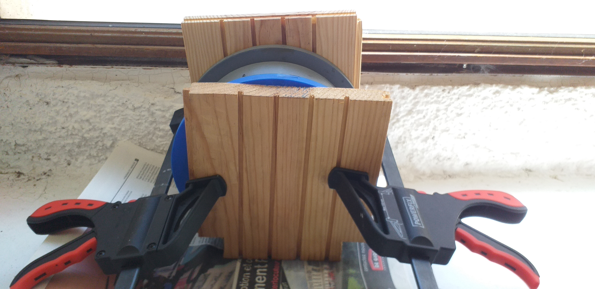

# Rapport-de-stage
Chez [Love Open Design](https://love-open-design.com/) du 14/06/2021 au 25/06/2021.

### Liens utiles
##### Ressources pour projets du stage
- [Tuto vidéo moulage carton de XYZ Aidan](https://www.youtube.com/watch?v=0ItPfhx3ulw)
- [Moules du cube terrain](https://www.thingiverse.com/thing:3912997)
- [Instructions pour réaliser le cube terrain](https://www.instructables.com/Recycle-Cardboard-Into-Anything-With-3D-Printing/)
- [Extraction amidon dans les pommes de terre](https://www.youtube.com/watch?v=G3Xb1-Set8c)
- [Introduction à GrassHopper](https://vimeo.com/475597078)
- [Faire des motifs sur GrassHopper](https://vimeo.com/299433240)

##### Entre technologie, art et société
- [Waag](https://waag.org/)
- [E-nable](https://e-nable.fr/)
- [HumanLab](https://myhumankit.org/) 
- [Nervous System](https://n-e-r-v-o-u-s.com/index.php)
- [Generative Hut](https://www.generativehut.com/)

##### Découvrir de nouvelles manières inspirantes de travailler
- [Synthaxe Markdown](https://www.markdownguide.org/cheat-sheet)
- [Formation multidisciplinaire sur les nouvelles formes de fabrication et de design distribué appliqué à l'industrie textile](https://textile-academy.org/)
- [Fabricademy: cours en ligne](https://vimeo.com/showcase/7626171)
- [Tutoriels Rhino et GrassHopper](https://class.textile-academy.org/tutorials/)
- [Design paramétrique avec Tylko, étagères sur-mesure](https://tylko.com/fr/)
- [Threejs](https://threejs.org/)
- [Les meilleurs web design](https://www.awwwards.com/)
- [Portfolio Richard Mattka](https://richardmattka.com/)
- [Portfolio Bruno Simon](https://bruno-simon.com/)

##### Matériaux
- [Recette bio-matériaux](https://drive.google.com/file/d/1Lm147nvWkxxmPf5Oh2wU5a8eonpqHCVc/view)
- [PreciousPlastic: créations à partir de déchets plastiques](https://preciousplastic.com/index.html)
- [FabTextiles](http://fabtextiles.org/)

#### Livres conseillés
- [Math Art: Tryth, Beauty, and Equation par Stephen Ornes, édition Sterling (2019)](https://www.goodreads.com/book/show/41739506-math-art)
- [Force: dynamic life drawing for animators par Michael D.Mattesi, édition Focal Press (2006)](https://www.amazon.fr/Force-Dynamic-Life-Drawing-Animators/dp/0240808452)
- [Fab Lab: la révolution en marche par Massimo Menichinelli, édition Pyramyd (2015)](https://www.amazon.fr/Fab-Lab-r%C3%A9volution-est-marche/dp/2350173410)
- [Color and Light: a guide for the realist painter par James Gurney, édition Andrews McMeel (2010)](https://www.amazon.fr/Color-Light-Guide-Realist-Painter/dp/0740797719)

---

## Moulage en carton
*Expérimentations sur le carton moulé d'après la vidéo de [XYZ Aidan](https://www.youtube.com/watch?v=0ItPfhx3ulw). Ce processus permettrait de donner une seconde vie aux cartons et papiers, les transformant alors en objets solides et potentiellement compostables.*

### 1. Phase de test avec cube terrain

#### Impression 3D

*Schéma des différents éléments du moule pour réaliser le cube terrain*

|  | Base | Mur | Presse |
| --- | --- | --- | --- |
| **Remplissage** | 10-15% | 15-20% | 10-15% |
| **Périmètres** | 2 | 3 | 2 |
| **Premières couches** | 2-3 | 2 | 2-3|
| **Dernières couches** | 3-4 | 2 | 3-4|

*Paramètres impression 3D sur logiciel [PrusaSlicer](https://www.prusa3d.com/prusaslicer/)*

*Résultat de l'impression 3D*

#### Préparation de la pâte et moulage 

Découpage de **boîtes d'oeufs** et de **cartons** que l'on mixe avec de l'**eau** et une **cuillère de riz bouilli**. On cherche à créer une **pâte** afin de la presser dans le moule "cube terrain" qui a été imprimé.

Il est important de bien **se débarasser de l'eau** en **essorant** la pâte après l'avoir mixée. En effet, l'eau est nécessaire dans cette mixture car elle permet de **rompre les fibres de cellulose qui donnent leurs formes aux cartons**. Ainsi, si on ne se débarasse pas de l'eau, le carton ne reprendre jamais une **forme vraiment solide**.

Enfin, on assemble la base et les murs dans lesquels on verse la pâte à carton. On ajoute ensuite la presse afin de **comprimer la pulpe** pour lui donner une **nouvelle forme** et **faire s'échapper l'excédent d'eau**.

***Problème*** : Le séchage n'est pas très rapide. 

***Solution*** : Retournement du moule afin de laisser mieux l'eau couler hors du moule et séchage au soleil.

#### Démoulage et résultat final

Grâce à la **rétractation** de l'objet, le **démoulage est assez facile**. Le cube-terrain semble également assez **solide**. Cependant, même après deux jours de séchage en plein soleil, la pâte à carton reste **humide** et **dégage de mauvaises odeurs**...

***Piste***: Chercher un moyen de faire s'évacuer davantage d'eau.

### 2. Phase d'expérimentation 1.0

#### Modélisation et impression 3D du moule

Suite à cette première phase de test, on imagine notre propre objet. Son concept: il se **retourne** afin de **dévoiler un autre contenant**.

---

On modélise un contenant pour créer un moule en plusieurs parties afin de **faciliter la future extraction** de l'objet.

***Problème***: Comment **séparer les morceaux du moule** sans le **casser**?

***Solution***: Ajouter des **bords** afin de permettre une bonne prise.

On imprime ensuite un **modèle réduit** du moule final. Cela permet de vérifier s'il n'y a pas de problèmes **avant d'imprimer en taille réelle**.

*Ecard qui fait bouger la partie supérieure du moule*

***Problèmes***: Comme les picôts sont très **droits**, il est **difficile d'assembler la base et les murs**. De plus, il y a un trop gros **écard** entre le **diamètre intérieur de la presse et celui des murs**: ainsi, le **couvercle** n'est pas vraiment attaché et **bouge beaucoup**.

***Solutions***: On **arrondie** les picôts et on en **ajoute** pour mieux fixer la presse avec les murs.

On imprime finalement les trois parties du moule.

| Base | Murs | Presse |
| --- | --- | --- |
|  |  |  |

***Problème***: En essayant d'assembler la presse et les murs, on observe un **jeu trop important** entre les picôts et leur place emboîtée dans les mur.

***Solutions***: Création de petites **bagues** afin de **combler cet écard**.

On teste trois différents types de bagues avec des dimensions différentes pour trouver la meilleure. On imprime ensuite celle qui fonctionne le mieux (celle du milieu).

Après avoir **limé** certaines des bagues, on les enfonce dans les trous de la base.

Cependant, lorsqu'on essaye d'assembler le socle au mur, les bagues **sortent des trous** et **se coincent autour des picots**. Ainsi, pour ne pas lutter inutilement, on **déplace chacune des bagues autour de son picôt**.

L'assemblage est désormais **facile** entre la base et les murs mais lorsqu'on les sépare l'un de l'autre, il y a une certaine **résistance**. En essayant de les séparer, un plôt s'est même **brisé** dans son trou. Ainsi, pour éviter ce genre d'accident, on **ponce* à nouveau **l'extérieur des picôts**.

#### Préparation de la pâte et moulage

On reproduit la même technique pour faire de la pâte à carton, à la différence que l'on ajoute **deux fois plus d'eau** afin de rendre la pâte encore plus **homogène**.

#### Démoulage et résultat final

Tout comme pour le cube terrain, le bol est assez **facile à démouler** mais il semble un peu **plus fragile**, probablement à cause des bords qui sont assez **fins**. Il dégage également une mauvaise odeur car il n'a pas sécher assez vite et le riz a du moisir. 

### 3. Phase d'expérimentation 1.1

*En réutilisant le même moule, on cherche à changer la composition de la pâte à carton pour éviter les moisissures et lui chercher une autre apparence. Contrairement à la première phase d'éxpérimentation, on extrait ici de l'amidon de pomme de terre en s'inspirant de la vidéo de [JuliRom VDM](https://www.youtube.com/watch?v=G3Xb1-Set8c)*

#### Préparation de la pâte et moulage

Tout d'abord, au lieu d'utiliser du riz bouillie, on essaye de récupérer l'**amidon de pommes de terre crues**. Pour cela, on commence par découper cinq pommes de terres de taille moyenne après les avoir **épluchées**. 

On les mixe ensuite avec environ **500ml d'eau déminéralisée** (eau de pluie).

On verse ensuite la mixture dans une **passoire** afin de **séparer l'amidon du reste des pommes de terre**. 

| Avant | Après |
| --- | --- |
|  |  |

On attend ensuite de 10 à 15 min que la partie liquide **décante**. Il prend alors une teinte **orangée**.
On mixe alors la **partie supérieur** qui est séparée de la pulpe de la pomme de terre avec du **carton** et de **l'eau déminéralisée** jusqu'à former une **pâte homogène**.

Puis on **essort** la pâte dans un chiffon. Cependant, on remarque qu'elle devient très **friable** et **difficile à mouler**, probablement car l'amidon a été **évacué lors de l'essorage**.

On décide alors de ne **pas trop essorer** afin de **mouler facilement le carton**. On expérimente également **deux pâtes différentes pour faire un même bol**: une pâte marron de **carton "classique"** et une pâte noir de **papier**. Il est important de noter que le papier est **plus facile à essorer** mais **produit moins de pulpe** et qu'il peut **teindre**.

#### Séchage et démoulage

Afin de faciliter l'évacuation de l'eau, on change l'**orientation du moule**. On l'encadre également par **deux planches en bois** afin de ne **pas fragiliser le moule**.

Tout comme pour le premier bol, celui-ci dégage une **odeur nauséabonde** et met **longtemps à sécher**... Il est en revanche intéressant **esthétiquement**: par exemple, à l'intérieur, la pâte noir a un peu teint la pâte marron.

#### Suggestions pour aller plus loin

Il serait intéréssant de créer un moule qui se concentre beaucoup plus sur **l'évacuation de l'eau**, par exemple avec une **presse plus grosse**.

/FUTUR SCHEMA/

## Reproduction du logo des FabLab: design paramétrique
*Introdution au design paramétrique en reproduisant le logo des FabLab avec l'outil [GrassHopper](https://www.grasshopper3d.com/). Le design paramétrique permet de modifier rapidement les paramètres d'une modélisation 3D. Ici, l'objectif est d'avoir une structure qui peut changer de taille tout en gardant ses composants en place.*

/SCHEMA POUR COMPRENDRE LE LOGO/
On commence d'abord par **analyser** et **comprendre** cette forme. On distingue alors **trois cylindres**, **trois pavés** et **un cube**.

*Première version du logo en design paramétrique sur GrassHopper.*

*Deuxième version après une meilleure prise en main de GrassHopper.*

On cherche à simplifier pour rendre plus fluide le changement de taille.

## A la découverte des FabLabs
*L'objectif est de créer une petite boîte en bois en s'inspirant des assemblages japonais. Les différentes parties de la boîtes doivent être pensées dans le but d'être par la suite découpées à la découpeuse laser.*

